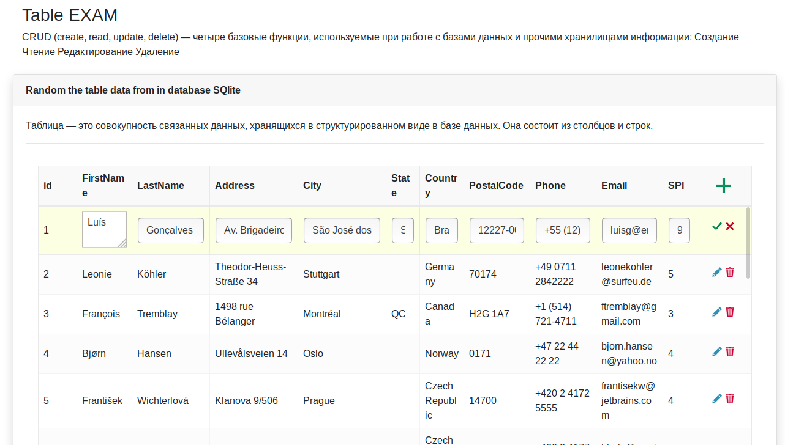

## CRUD Python Flask (web-interface)
The Web interface on job with Database SQLite.  
Main steps:
- Render page (Flask)
- Load javascript interface client (js).
- Tune table view display of database (settings JsGrid)
- Rest api interaction client-server (ajax)

]
